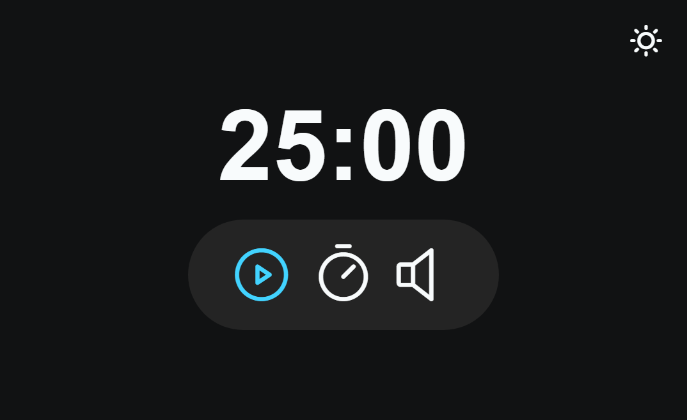

<h1 align="center"> Focus Timer </h1>

Projeto desenvolvido durante o desenvolvimento do curso Explorer da Rocketseat. 🚀🔥

  <a href="#-tecnologias">Tecnologias</a>&nbsp;&nbsp;&nbsp;|&nbsp;&nbsp;&nbsp;
  <a href="#-projeto">Projeto</a>&nbsp;&nbsp;&nbsp;|&nbsp;&nbsp;&nbsp;
  <a href="#-links">Links</a>

 

  

> Curso Explorer

Projeto voltado à aplicação de novas funcionalidades JavaScript. O projeto contém um timer estilo Pomodoro, música, modo claro e escuro e aplicação de muita lógica.  💻❤️ 

## 🚀 Tecnologias

Esse projeto foi desenvolvido com as seguintes tecnologias:

- HTML 
- CSS
- Figma
- JavaScript
- Git e Github

     

## 💻 Projeto

Perfeito para te auxiliar na hora dos seus estudos: Focus Timer.

## 🔗 Links

 